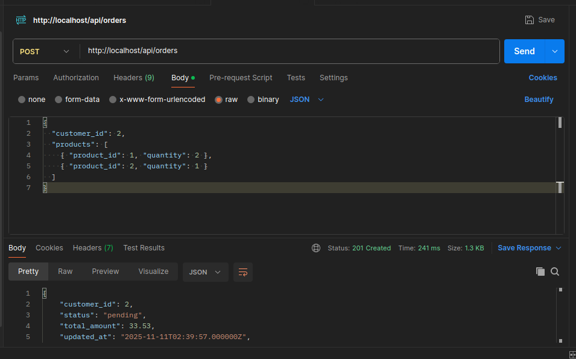
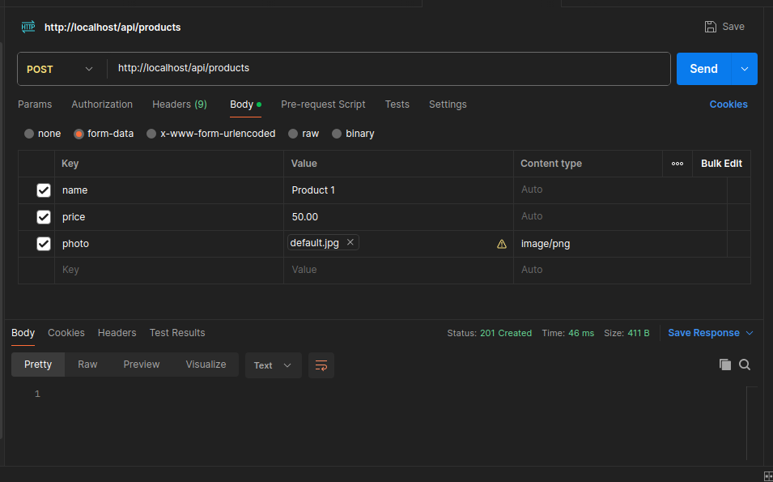

# Back-end Challenge — Pastelaria (Prazo: 10/11/2025)

## Como inicializar o projeto

Abaixo passos para rodar o projeto localmente usando Laravel Sail (Dockerizado).
Pré-requisitos: Docker e docker-compose.

1. Clonar o repositório
```bash
git clone https://github.com/marksousa/testecomerc.git
```

2. Instalar dependências
```bash
./vendor/bin/sail composer install
```

3. Copiar .env e gerar APP_KEY
```bash
cp .env.example .env
./vendor/bin/sail artisan key:generate
```

4. Subir containers
```bash
./vendor/bin/sail up -d
```

5. Executar migrations e seeders
```bash
./vendor/bin/sail artisan migrate --seed
```

6. Criar link simbólico para storage
```bash
./vendor/bin/sail artisan storage:link
```

7. Preparar diretório de testes para uploads fake (opcional, rodar em caso de erro de permissão)
   Alguns testes usam Storage::fake('public') e salvam em storage/framework/testing/disks/public. Se houver erro UnableToCreateDirectory criar o diretório e ajustar permissões:
```bash
./vendor/bin/sail exec laravel.test mkdir -p storage/framework/testing/disks/public
./vendor/bin/sail exec laravel.test chmod -R 777 storage
```

8. Acessar http://localhost:8025/ para verificar o cliente de email e verificar as mensagens enviadas após criação de um novo pedido. Utilizado aqui o Mailpit na porta 8025

9. Para rodar testes Unitários e Feature/Integração
```bash
./vendor/bin/sail test
```

10.  Rodar a aplicação
```bash
./vendor/bin/sail up -d
```

11. Acessar http://localhost

12. Documentação Swagger: acessar http://localhost/api/documentation
(algumas rotas não estão ainda completamente documentadas)

### Diagrama ER


### Exemplos Postman

```
{
  "customer_id": 2,
  "products": [
    { "product_id": 1, "quantity": 2 },
    { "product_id": 2, "quantity": 1 }
  ]
}
```



# Enunciado do Desafio

## Visão geral
A necessidade é desenvolver uma API RESTFul para o gerenciamento de pedidos de uma pastelaria utilizando o framework Laravel ou Lúmen.

## Instruções para entrega

-   Versione, com git, e hospede seu código em algum serviço de sua preferência: github, bitbucket, gitlab ou outro.
-   Crie um README com instruções claras sobre como executar sua obra.

## Sobre o projeto

A API Restful deve contemplar os módulos Cliente, Produto e Pedido, sendo que cada um deverá conter endpoints CRUDL.

As tabelas devem conter as seguintes informações:

-   Clientes nome, e-mail, telefone, data de nascimento, endereço, complemento, bairro, cep, data de cadastro;
-   Produtos nome, preço, foto;
-   Pedidos código do cliente, código do produto, data da criação;

## Requisitos

-   Não devem existir dois clientes com o mesmo e-mail.
-   O produto deve possuir foto.
-   Os dados devem ser validados.
-   O sistema deve conter uma série de tipos de produtos já definidos.
-   O pedido deve contemplar N produtos.
-   O cliente pode contemplar N pedidos.
-   Após a criação do pedido o sistema deve disparar um e-mail para o cliente contendo os detalhes do seu pedido.
-   Os registros devem conter a funcionalidade de soft deleting.
-   Padronização PSR
-   Nomenclatura de classes, métodos e rotas no padrão americano.
-   Testes unitários.
-   Dockerizar a aplicação

## Critérios de avaliação

-   Profundidade do conhecimento e utilização das funcionalidades do framework.
-   Organização do código.
-   Padronização PSR
-   Fidelidade aos requisitos solicitados.
-   Testes Unitários
